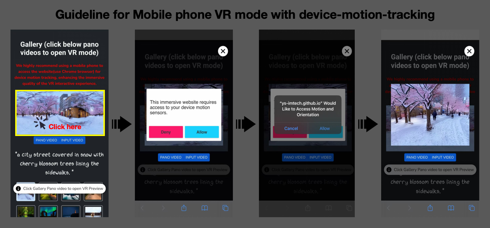

# Imagine360: Immersive 360 Video Generation from Perspective Anchor


[**Project page**](https://ys-imtech.github.io/projects/Imagine360/) | [**Paper**](https://arxiv.org/abs/2412.03552) | [**Data**](https://github.com/3DTopia/Imagine360/blob/master/dataset/dataset.md)  | [**Video**](https://youtu.be/gRGo4B41GXY)


[Jing Tan*](https://sparkstj.github.io/), 
[Shuai Yang*](https://ys-imtech.github.io/), 
[Tong Wu✉️](https://wutong16.github.io/), 
[Jingwen He](https://github.com/hejingwenhejingwen), 
[Yuwei Guo](https://guoyww.github.io/), 
[Ziwei Liu](https://liuziwei7.github.io/), 
[Dahua Lin✉️](http://dahua.me/)

<p style="font-size: 0.6em; margin-top: -1em">* Equal Contribution，✉️ Corresponding author</p></p>


<p align="center">
<a href="https://arxiv.org/abs/2412.03552">"></a>
<a href="https://ys-imtech.github.io/projects/Imagine360/"></a>
<a href="https://github.com/3DTopia/Imagine360/blob/master/dataset/dataset.md"></a>
<a href="https://www.youtube.com/watch?v=gRGo4B41GXY"></a>
<a href="" target='_blank'>

</a>
</p>

## ✨ Updates
**[2025-03-19]** 🔥 Release our curated 360 video dataset `YouTube360`.

**[2025-01-30]** Release `inference code` and `checkpoints`!

## 📷 Quick Demos（only show panoramic video here）
More results can be found on our [Project Gallery](https://ys-imtech.github.io/projects/Imagine360/). 


<table class="center">
    <tr>
    <td></td>
    <td></td>
    <td></td>
    </tr>
</table>
<!-- <p style="margin-left: 2em; margin-top: -1em">Model：<a href="https://civitai.com/models/30240/toonyou">ToonYou</a><p> -->

<table>
    <tr>
    <td></td>
    <td></td>
    <td></td>
    </tr>
</table>

<table>
    <tr>
    <td></td>
    <td></td>
    <td></td>
    </tr>
</table>


## 📖 VR Mode Guideline
<b>We highly recommend using a mobile phone to access the [website(better use Chrome browser)](https://ys-imtech.github.io/projects/Imagine360/) for device motion tracking, enhancing the immersive quality of the VR interactive experience. </b>

🔥The Loading may be a little slow, but your wait will be worth it !!!



## Dataset
Please refer to [`dataset/dataset.md`](dataset/dataset.md) for the metadata of our curated YouTube videos.

## 🔧 Steps for Inference
### Prepare Environment 
```
git clone https://github.com/3DTopia/Imagine360.git
cd Imagine360

conda create -n imagine360 python==3.10
conda activate imagine360

pip install -r requirements.txt
```

- Use GeoCalibration as elevation estimation model (by default):
```
python -m pip install -e "git+https://github.com/cvg/GeoCalib#egg=geocalib"
```
- Use PerspectiveFields as elevation estimation model:
```
pip install git+https://github.com/jinlinyi/PerspectiveFields.git
```

### Download Weights
Download our checkpoints from [google drive](https://drive.google.com/drive/folders/1kjuZqJz8ZDkhUi9tb7AIsc9JlQPRK97Z?usp=sharing), and also [[sam_vit_b_01ec64](https://github.com/facebookresearch/segment-anything/tree/main?tab=readme-ov-file#model-checkpoints)], [[stable-diffusion-2-1](https://huggingface.co/stabilityai/stable-diffusion-2-1)], and [[Qwen-VL-Chat](https://huggingface.co/Qwen/Qwen-VL-Chat)].

Update the paths to these pre-trained models in `configs/prompt-dual.yaml`.

### Perspective-to-360 Video Generation
```
python inference_dual_p2e.py --config configs/prompt-dual.yaml
```
If the result does not align with expectations, try modify text prompt or set different seeds (-1 for random seed) in `configs/prompt-dual.yaml`.

## Super Resolution [Optional]
For better visualization under VR mode, we recommend to use [VEnhancer](https://github.com/Vchitect/VEnhancer) for video super resolution. Follow [the instructions](sr/README.md) to update VEnhancer code for 360 close-loop continuity.

## 📧 Contact Us
Jing Tan: [tj023@ie.cuhk.edu.hk](mailto:tj023@ie.cuhk.edu.hk)  
Shuai Yang: [yang_shuai@sjtu.edu.cn](mailto:yang_shuai@sjtu.edu.cn)  
Tong Wu: [wutong16@stanford.edu](mailto:wutong16@stanford.edu)  

## 📆 Todo
- [x] Release Inference Code 
- [x] Release Dataset
- [ ] Gradio Demo
- [ ] Release Train Code 

## 📚 Acknowledgements
Special thanks to [PanFusion](https://github.com/chengzhag/PanFusion), [FollowYourCanvas](https://github.com/mayuelala/FollowYourCanvas), [360DVD](https://github.com/Akaneqwq/360DVD) and [AnimateDiff](https://github.com/guoyww/AnimateDiff) for codebase and pre-trained weights.

## ✒️ Citation
If you find our work helpful for your research, please consider giving a star ⭐ and citation 📝

```bibtex
@article{tan2024imagine360,
  title={Imagine360: Immersive 360 Video Generation from Perspective Anchor},
  author={Tan, Jing and Yang, Shuai and Wu, Tong and He, Jingwen and Guo, Yuwei and Liu, Ziwei and Lin, Dahua},
  journal={arXiv preprint arXiv:2412.03552},
  year={2024}
}
```
