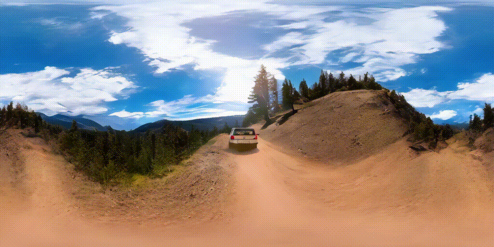
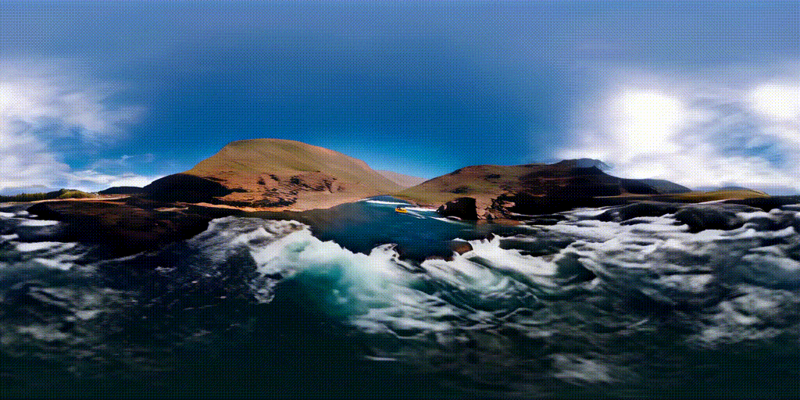
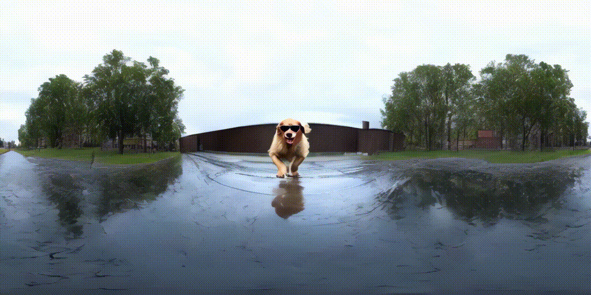
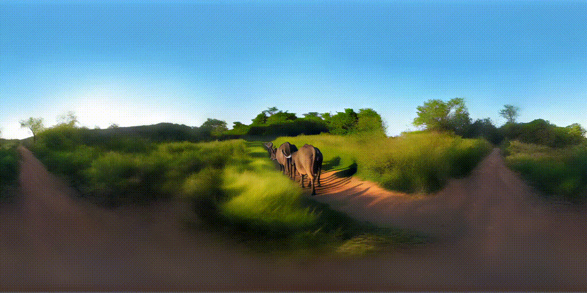
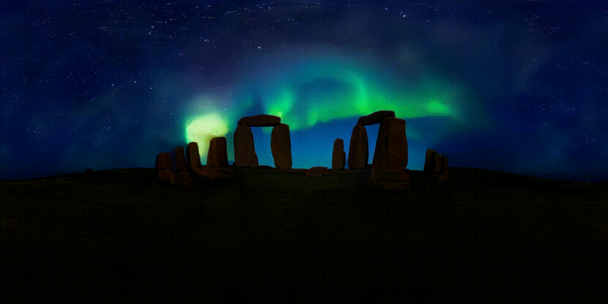

# Imagine360: Immersive 360 Video Generation from Perspective Anchor


[**Project page**](https://ys-imtech.github.io/projects/Imagine360/) | [**Paper**](https://arxiv.org/abs/2408.13252) | [**Video**](https://www.youtube.com/watch?v=oeGw8GN4yJc)


[Jing Tan*](https://sparkstj.github.io/), 
[Shuai Yang*](https://ys-imtech.github.io/), 
[Tong Wu](https://wutong16.github.io/), 
[Jingwen He](https://scholar.google.com/citations?user=GUxrycUAAAAJ&hl=zh-CN), 
[Yuwei Guo](https://guoyww.github.io/), 
[Ziwei Liu](https://liuziwei7.github.io/), 
[Dahua Lin](http://dahua.me/)

<p style="font-size: 0.6em; margin-top: -1em">*Equal Contribution</p>


<p align="center">
<a href="https://arxiv.org/abs/2408.13252">"></a>
<a href="https://ys-imtech.github.io/projects/Imagine360/"></a>
<a href="https://www.youtube.com/watch?v=oeGw8GN4yJc"></a>
<a href="" target='_blank'>

</a>
</p>


## 📷 Quick Demos（only show panoramic video here）
More results can be found on our [Project Gallery](https://ys-imtech.github.io/projects/Imagine360/). <b>We highly recommend using a mobile phone to access the [website](https://ys-imtech.github.io/projects/Imagine360/) for device motion tracking, enhancing the immersive quality of the VR interactive experience. </b>


<table class="center">
    <tr>
    <td></td>
    <td></td>
    <td></td>
    </tr>
</table>
<!-- <p style="margin-left: 2em; margin-top: -1em">Model：<a href="https://civitai.com/models/30240/toonyou">ToonYou</a><p> -->

<table>
    <tr>
    <td></td>
    <td></td>
    <td></td>
    </tr>
</table>

<table>
    <tr>
    <td></td>
    <td></td>
    <td></td>
    </tr>
</table>

## Contact Us
Jing Tan: [tj023@ie.cuhk.edu.hk](mailto:tj023@ie.cuhk.edu.hk)  
Shuai Yang: [yang_shuai@sjtu.edu.cn](mailto:yang_shuai@sjtu.edu.cn)  
Wu Tong: [wt020@ie.cuhk.edu.hk](mailto:wt020@ie.cuhk.edu.hk)  

## 👨‍💻 Todo
- [ ] Release Code (Open source in January 2025)

## ✒️ Citation
If you find our work helpful for your research, please consider giving a star ⭐ and citation 📝

<!-- ```bibtex
@article{yang2024layerpano3d,
  title={LayerPano3D: Layered 3D Panorama for Hyper-Immersive Scene Generation},
  author={Yang, Shuai and Tan, Jing and Zhang, Mengchen and Wu, Tong and Li, Yixuan and Wetzstein, Gordon and Liu, Ziwei and Lin, Dahua},
  journal={arXiv preprint arXiv:2408.13252},
  year={2024}
}
``` -->